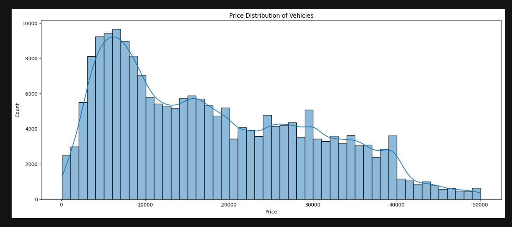
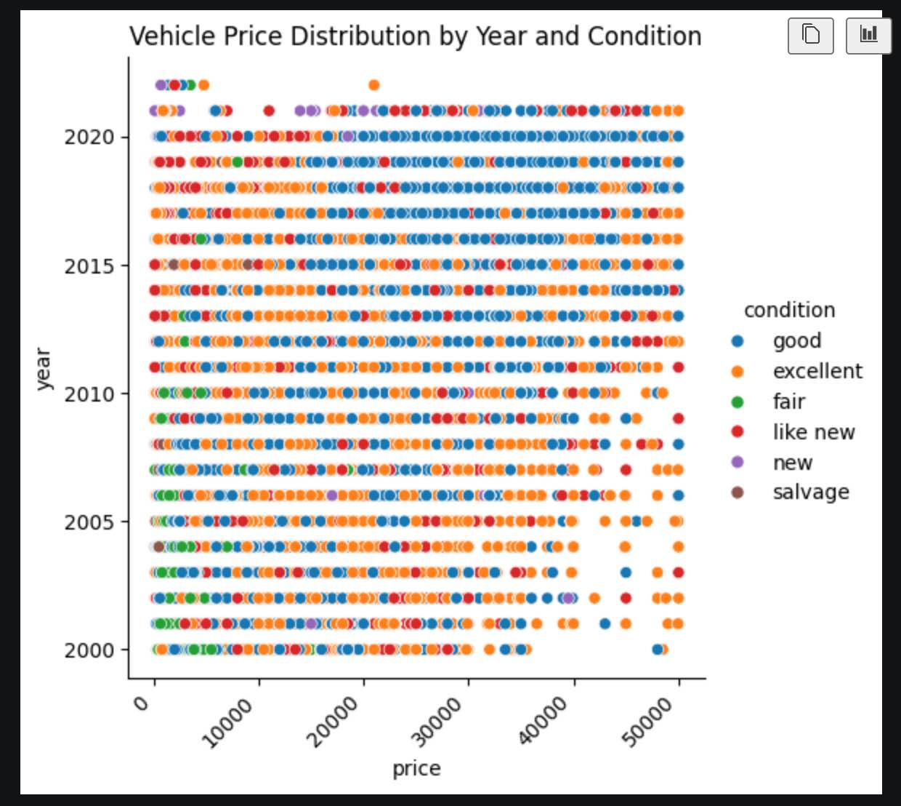
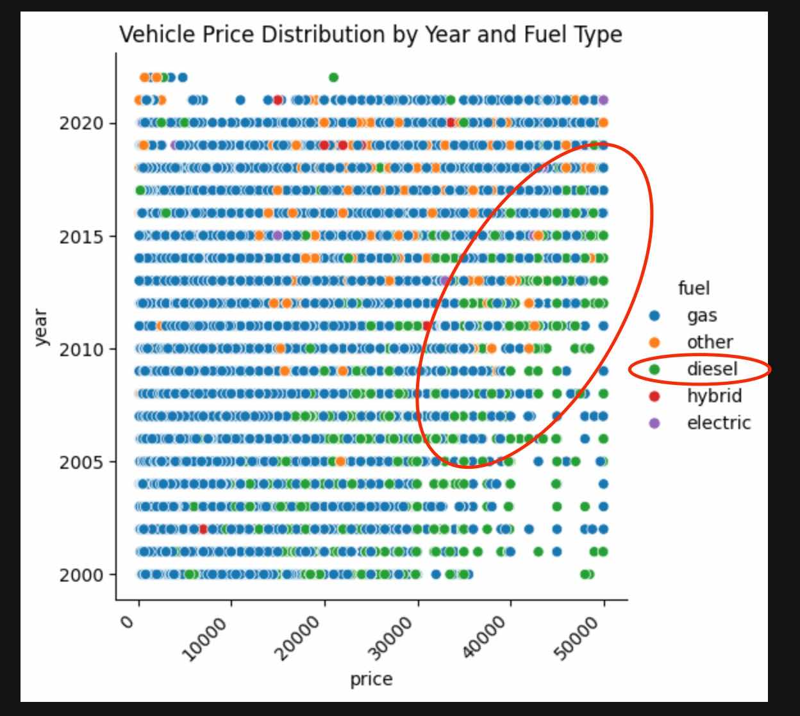
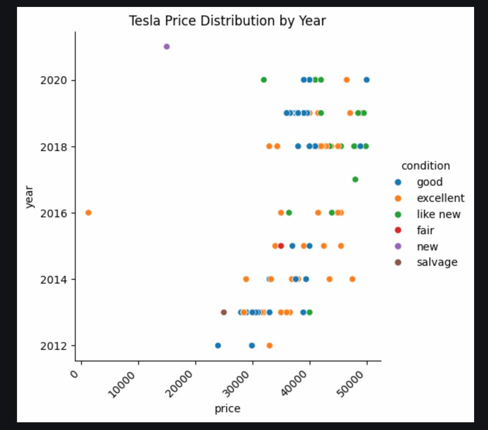
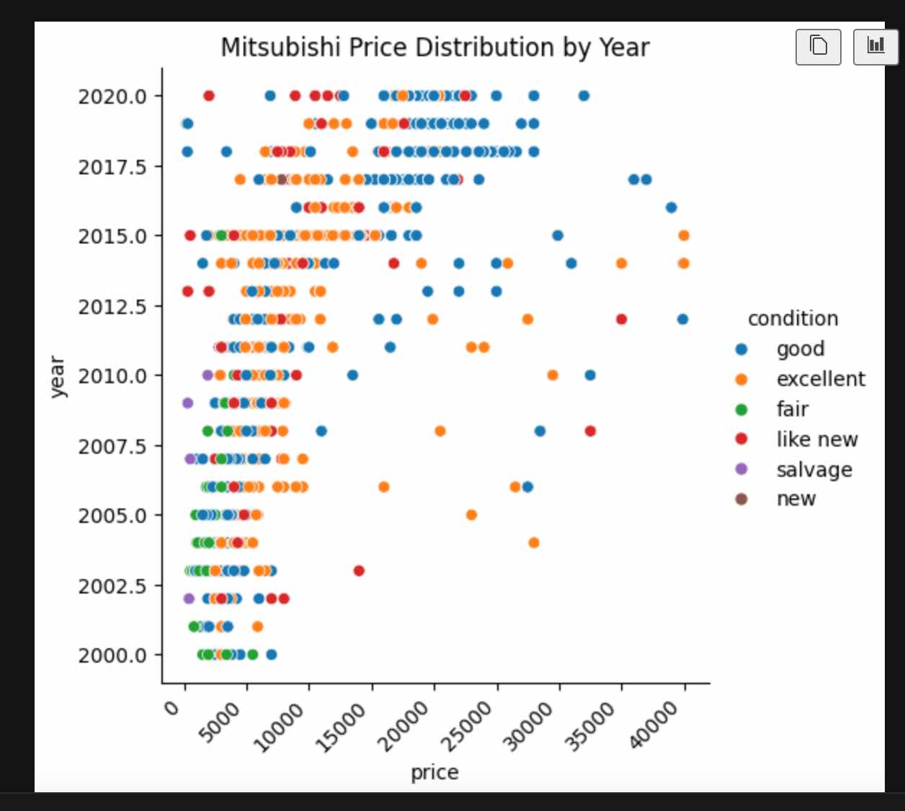

# Used Car Inventory Model

An ML model to predict used car prices and identify which features drive value. Built for used-car dealerships to understand their inventory better.

From the get go, this looks like a "feature selection" problem

---

## Understanding the Data

Started with a dataset of ~427,000 used car listings with 18 features. Here's what we found:

- **Dataset size**: 427,000 rows, 18 columns (year, manufacturer, condition, price, odometer, fuel type, transmission, drivetrain, vehicle type, paint color, title status, and more)
- **Price range**: $0 to $10M (lots of outliers and data quality issues)
- **Years**: Vehicles from 1900 to 2022 (mostly 2000+)
- **Condition values**: good, excellent, fair, like new, new, salvage (and missing values)
- **Key insight**: Price distribution is NOT normal - right-skewed with most cars clustered at lower prices



---

## Data Cleanup

Cleaned up the data to make it useful for modeling:

- **Dropped useless columns**: id, region, model, VIN, paint_color, state, size, cylinders (these don't help predict price or are redundant)
- **Filled missing values**: manufacturer → 'unknown', fuel → 'other', transmission → 'other', drive → 'fwd', type → 'other' (kept as many rows as possible)
- **Removed outliers**:
  - Vehicles older than 2000 (old/collector cars skew the model)
  - Prices below $25 or above $100k (unrealistic listings + outliers)
  - Odometer readings below 500 or above 250k miles (suspicious/unrealistic data)
- **Final dataset**: ~165,000 clean records ready for modeling

---

## Data Prep for Modeling

Before training, we encoded categorical variables properly to avoid bias:

**Numeric Features** (StandardScaler):

- year, odometer
- Scaled to mean=0, std=1 so they're on the same scale

**Ordinal Features** (OrdinalEncoder):

- condition: fair < good < like new < excellent (has natural ordering)
- Encoded as: 0, 1, 2, 3, etc.

**Nominal Features** (OneHotEncoder):

- manufacturer, fuel, title_status, transmission, drive, type (no natural order)
- Creates binary columns for each category (e.g., fuel_diesel=1, fuel_electric=0)
- Why? Avoids artificial bias (prevents model from thinking "diesel > electric" or "bmw > audi" just because of numbering)

All transformations combined in a ColumnTransformer pipeline for consistent preprocessing.

---

## Modeling

I built two regression models (the ones taught in class) to find price drivers:

**Ridge Regression (L2 Regularization)**

- Keeps all features with scaled-down coefficients
- Good for understanding overall relationships
- RMSE: Shows prediction accuracy in dollars
- R²: 0.7413~ (proportion of price variation we can explain)

**Lasso Regression (L1 Regularization)**

- Performs automatic feature selection (zeros out unimportant features)
- Shows which attributes REALLY matter for price
- Found 51 key features out of ~400+ transformed features
- Top positive drivers (increase price):
  - Excellent condition
  - Newer vehicles
  - Lower mileage
- Top negative drivers (decrease price):
  - Salvage title
  - Manual transmission
  - Older model years

**Model Performance**:

- R² Score: 0.7389
- 20% test set evaluation to check generalization

---

## Evaluation of Results

```
The model gave below training results
--- RidgeCV Results ---
RMSE: 6,070.53
R2 Score: 0.7413

--- LassoCV Results ---
RMSE: 6,097.80
R2 Score: 0.7389

Ridge selected 74 features
Lasso selected 51 features

Positively imapacting features:

                            feature    ridge_coef   lasso_coef
44                 ohe__fuel_diesel   8255.872625  9547.688920
39          ohe__manufacturer_tesla  11981.741855  7045.594127
34        ohe__manufacturer_porsche   9599.155031  6624.754172
0                         num__year   4979.681250  4962.363127
71                  ohe__type_truck   5375.543175  4908.046474
24          ohe__manufacturer_lexus   4669.553189  4436.293014
6            ohe__manufacturer_audi   3847.887350  3686.871232
49          ohe__title_status_clean   3951.219413  3619.516795
27  ohe__manufacturer_mercedes-benz   3236.109463  3118.582997
57          ohe__transmission_other   2276.725170  2873.409686

Negatively impacting features:
                         feature   ridge_coef   lasso_coef
30  ohe__manufacturer_mitsubishi -6554.998781 -5564.118880
65           ohe__type_hatchback -4883.170360 -5319.989025
22         ohe__manufacturer_kia -5323.749371 -4770.459260
13        ohe__manufacturer_fiat -8075.885335 -4629.941319
18     ohe__manufacturer_hyundai -4425.873480 -3946.221444
59                ohe__drive_fwd -2537.532719 -3889.292135
1                  num__odometer -3655.351005 -3682.850103
70               ohe__type_sedan -3376.643216 -3614.829523
32      ohe__manufacturer_nissan -3883.360421 -3525.561689
73               ohe__type_wagon -3322.992076 -3507.024278
```

### Findings from above:

From the above,

- It looks like diesel fuel type vehicles sell better. Most probably trucks like F150 etc. used by contractors and small business owners
- When this data was curated (in 2022), Tesla vehicles were in a very high demand
- No wonder to see Lexus as one of the top brands for gas vehicles
- Mitsubishi vehicles are the most difficult to sell

Some plots to show this:

## Expected plot



## Top Performer by Model



## Surprising Positive Coeff



## Surprising Negative Coeff



---

## How Used-Car Dealers Can Use This

**Inventory Pricing**:

_How to use this_:

- **Pricing**: Dealer can input a car's features (year, condition, mileage, etc.) → get a price estimate with RMSE confidence

For eg. for "Year" imapact:
Take the "Year" coefficient and std. deviation (from above) to make the calculations as:

```
Standard Deviation of Year: 5.14 years
Taking the "Year" coefficient from above,
price_per_year = 4962.363127 / std. deviation
price_per_year = 4962.363127 / 5.14
price_per_year = $964.97
```

Which means, by the passage of every year, just the year will reduce the price by $964

The Lasso model identified which features have the biggest impact on price.
Here's what actually drives value:

_Features that INCREASE price (positive drivers)_:

- **Vehicle Year**: Each additional year adds to price
- **Excellent Condition**: Excellent rated vehicles command thousands more than fair condition
- **Lower Mileage**: Every 10k miles reduces value
- **Transmission Type**: Manual transmissions actually reduce price
- **Fuel Type**: Electric/Hybrid commands premium; Gas is standard
- **Popular Manufacturers**: Toyota, Honda, etc. hold value better than unknown brands

_Features that DECREASE price (negative drivers)_:

- **Salvage Title**: Reduces value significantly (unrepairable damage history)
- **High Mileage**: Way over 150k miles tanks the price
- **Poor Condition**: Fair or salvage rated vehicles lose a lot in value
- **Manual Transmission**: Buyers prefer automatics; manual is a marker for older/budget cars
- **Uncommon Manufacturers**: Unknown or rare brands get a discount

**Stock Selection**:

- **Stock strategy**: Buy cars with positive drivers (newer, low mileage, excellent condition), avoid negatives (salvage, very old, manual)

---

## Note

- I used the models that were taught in this curriculum (Ridge & Lasso) & avoided using RandomForest etc.
- I tried to use GridSearchCV but it kept on running for a loong time and started heating up my machine. So, removed it & did simple comparison

## Files

- `carprices.ipynb` - Full analysis and modeling pipeline
- `data/vehicles.csv` - Raw dataset (~427k listings)
- `images/*` - All images referenced in this README
